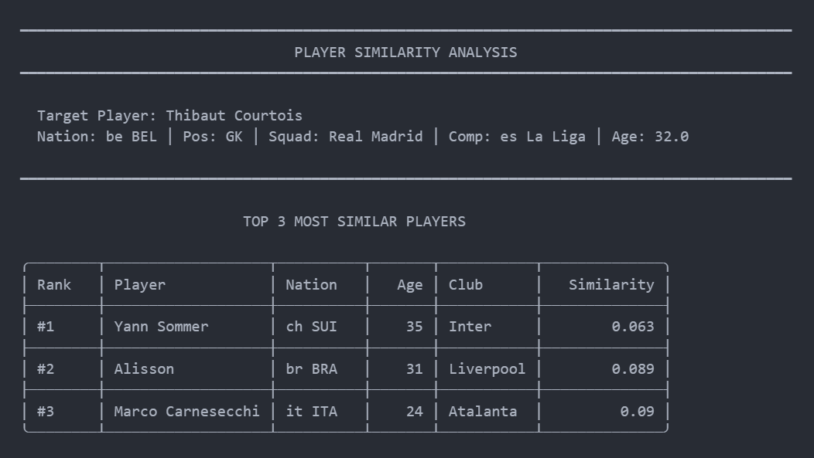
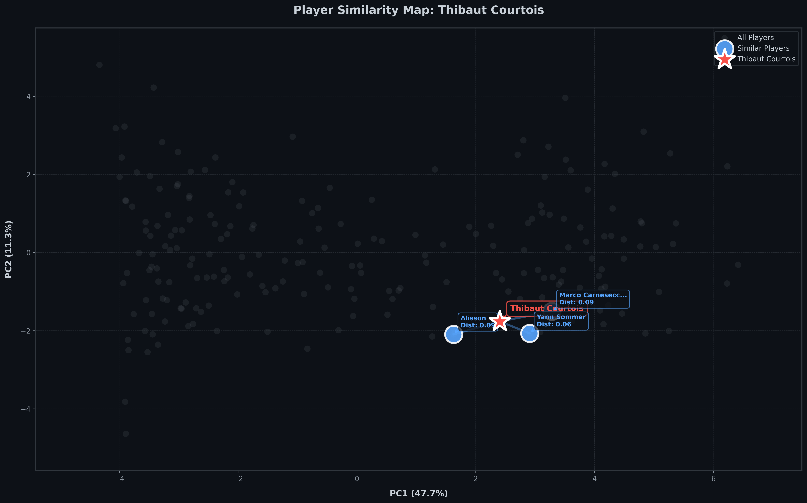
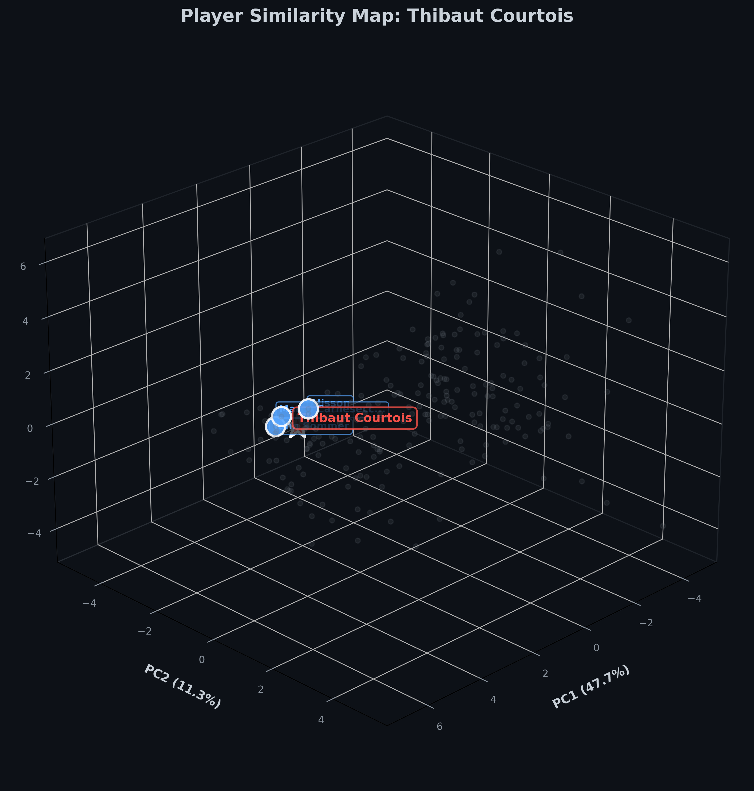
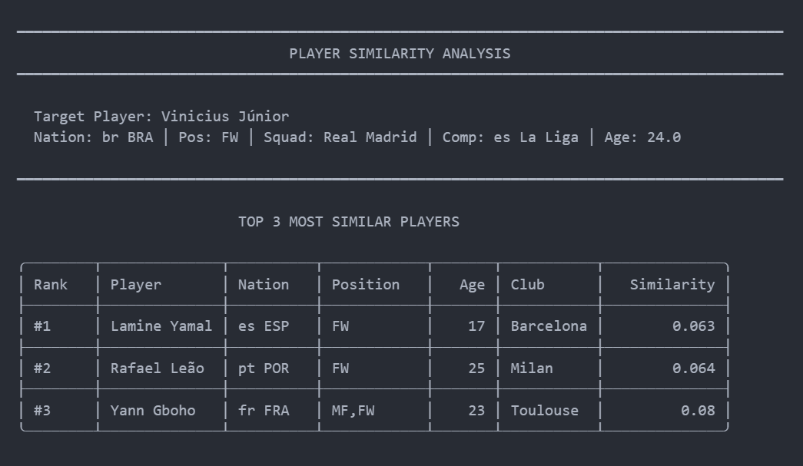
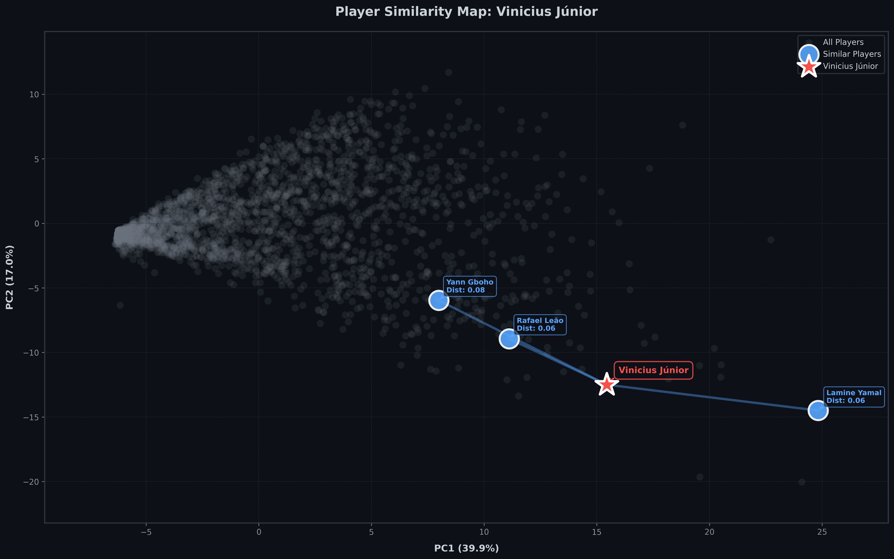
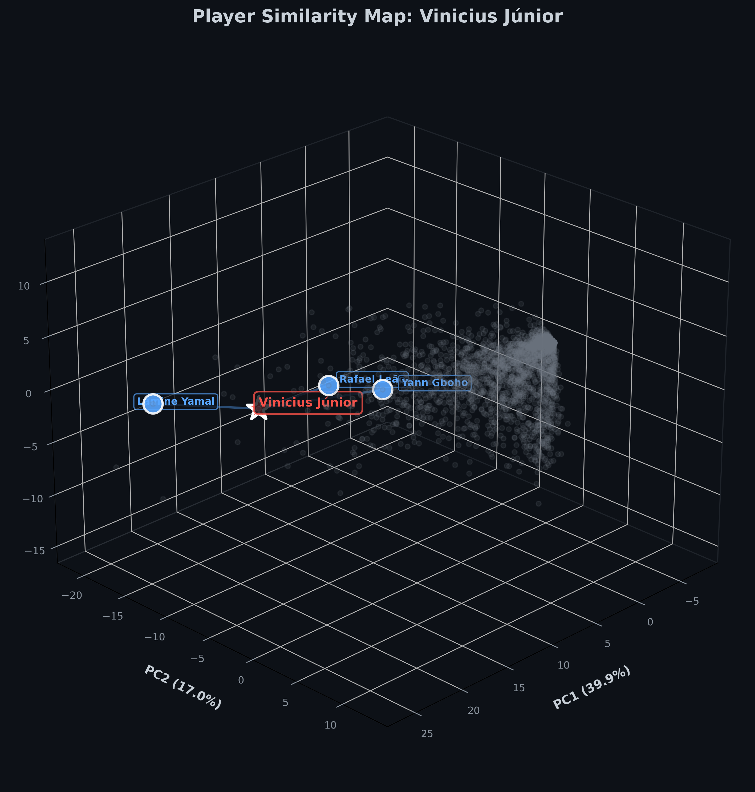

# ⚽ Football Player Similarity Search 

This project finds similar football players based on their 2024-2025 season statistics using dimensionality reduction (PCA) and K-Nearest Neighbors algorithm.

## ℹ️ About  

This project analyzes football player statistics and helps find players with similar performances. Given any player, it identifies the 3 most statistically similar players based on their performance metrics.
I separated goalkeepers from outfield players because they have fundamentally different statistics.

## 🗂️ Dataset

I used the [Football Players Stats 2024-2025](https://www.kaggle.com/datasets/hubertsidorowicz/football-players-stats-2024-2025) dataset from Kaggle, which includes comprehensive performance statistics for players across top 5 major leagues, sourced from FBref. 

## 🧠 Approach

**Data Cleaning** - Removed 150+ redundant columns to focus on meaningful performance metrics.

**Removed Unnecessary Columns** - Further cleaned the data by removing columns that didn't contribute to finding similarities or could create noise in the analysis.

**Player Segmentation** - I separated the analysis into two groups:
  - **Goalkeepers:** Their role is fundamentally different, so I removed columns that weren't relevant to goalkeeper performance.
  - **Outfield Players:** Evaluated on attacking and defensive contributions like goals, assists, passes, tackles, and dribbles. I removed columns specific to goalkeepers or irrelevant to outfield play.

This separation was necessary because comparing a goalkeeper stats to a striker/midfielder/defender would be meaningless - they're measured on completely different scales and objectives.

**Dimensionality Reduction** - Applied PCA to identify core playing style patterns while reducing the feature space.

**Similarity Matching** - Used K-Nearest Neighbors with cosine similarity to find the 3 most similar players based on their reduced feature representation.

## 📊 Results

<h3 align="center">Goalkeeper Similarity Analysis</h3>

<p align="center">
  
</p>

<h4 align="center">2D and 3D Visualization</h4>

<p align="center">
  
  
</p>

<h3 align="center">Outfield Player Similarity Analysis</h3>
<p align="center">
  
</p>

<h4 align="center">2D and 3D Visualization</h4>

<p align="center">
  
  
</p>

## 🛠️ Required Libraries

- pandas
- numpy  
- scikit-learn
- matplotlib
- seaborn

## 💻 Installation

1. **Clone the repository:**
```bash
git clone https://github.com/meheraj-hossain95/Football-Player-Similarity-Search.git
cd Code
```
2. **Install required packages:**
```bash
pip install pandas numpy scikit-learn matplotlib seaborn 
```
3. **Download the [Football Players Stats 2024-2025](https://www.kaggle.com/datasets/hubertsidorowicz/football-players-stats-2024-2025) dataset from Kaggle and place it in the project directory.**

## ⚖️ License
[MIT LICENSE](LICENSE)
